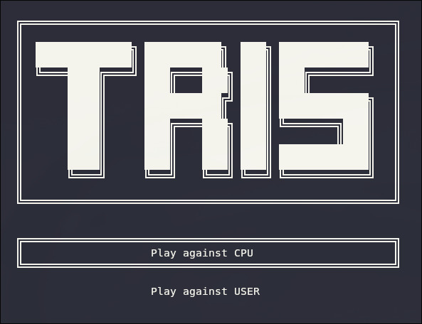
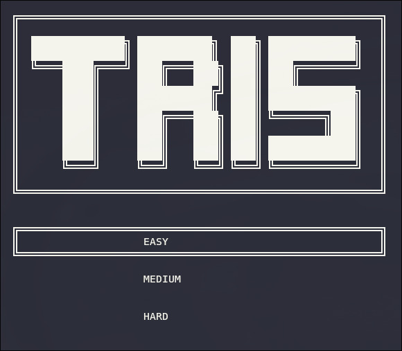
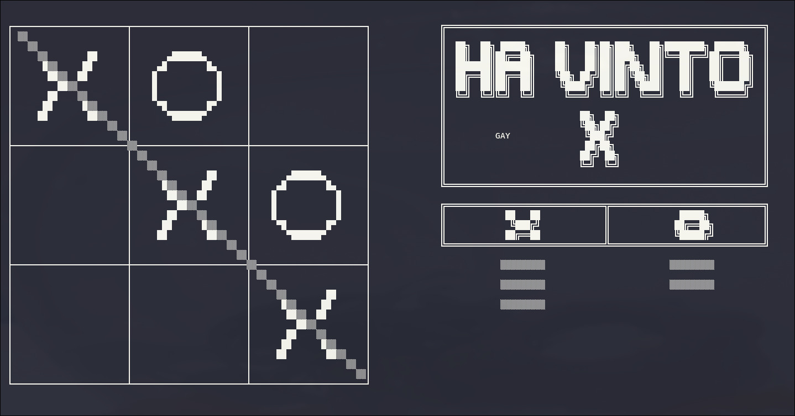

# Tic-tac-toe
This is a project where I tried to program the game Tic-Tac-Toe using the C language.
For now, the game is in Italian, infact in the title display the name is *TRIS* (tic-tac-toe in italian).
## project composition
The project is divided into the following folders:
- `prg/` ----| The main program is located here: ---`tris.c`
- `lib/` ----| The libraries are located here: --------`tris_lib.c`
- `head/` ---| The header file is located here: -------`tris_lib.h`
- `build/` --| The Makefile is located here, and the compilation results will end up here.
- `doc/` -----| Here are the files useful for the README.md.
## project use
To use this program is required the library `ncurses.h`, also `make` and the compiler `gcc`.

Once the files are been downloaded, either via the browser or by using the command:  

```bash
git clone git@github.com:Gabri360/Tic-tac-toe.git
```
 

You need to enter the folder `Tic-tac-toe/` and start the compilation with the command:  

```bash
make
```

This will create a `tris` executable file (as well as object files in the `build/` folder). Then you have to run it from terminal with the command (on linux):
```bash
./tris
```
The game will appear directly on the terminal.

Another available command is: 
```bash 
make clean
```
which deletes all object files from `build/`

## Game
The game offers two modes: 
- `Play against CPU` : which means that the opponent's moves are made by an **algorithm**.
- `Play against USER` : which means that the opponent's moves are made by another **person**.


---
If you select CPU mode, you can choose from three different, increasingly difficult levels.

- `EASY`
- `MEDUIM`
- `HARD`


---
When someone wins, the game-over screen will be displayed, featuring a table that tracks previous wins.



## command
To interact with the game, you can use the following keyboard commands:
- `wasd` or `dir_arrow`: to move the cursor
- `e` or `ENTER` or `SPACE` : to insert the symbol (*X* or *O*)

When the game is ended you ca use:

- `ENTER` : to start another game

You can use the following keyboard commands at any point during the game:
- `q` : to quit
- `r` : to reset the match

